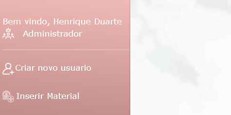
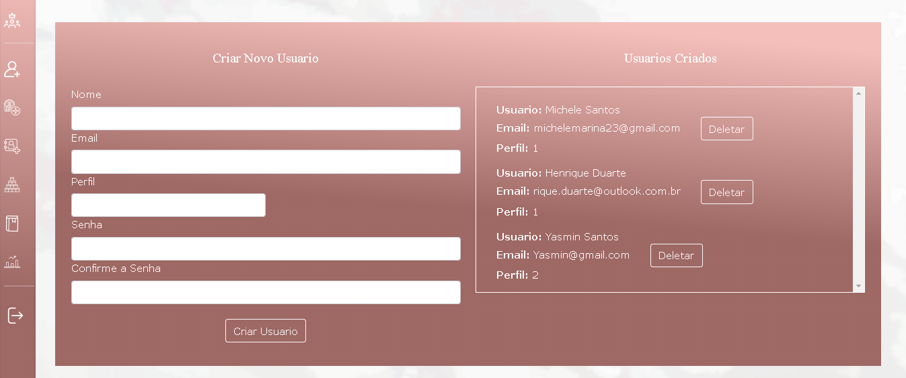
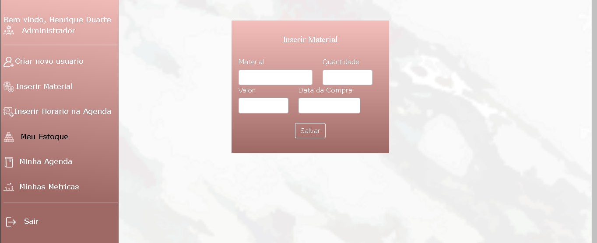
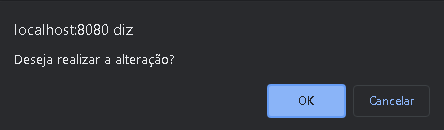
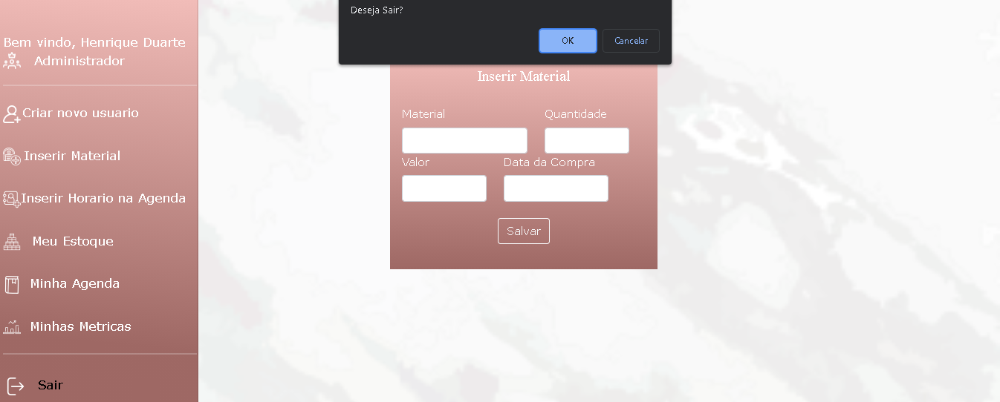

<h1>Sistema de Estoque</h1>

<h2> Instalação local</h2>

Dentro do diretorio, Deve ser feito a instalação das dependencias com o seguinte comando:

<i>- npm install;</i>

<h2>Iniciando servidor</h2>

Após isso, para iniciar, dentro do diretorio raiz, deve ser executado o seguinte comando:

<i>- npm run serve;</i>

<i>- Tambem é necessario executar o aplicativo API_estoque;</i>

<h2> Orientações </h2>

- Por padrão, a aplicação estará configurada para escutar a porta 8080, para altera-la, executar o seguinte comando: 
 

<i>- npm run serve -- --port "PORTA DESEJADA"</i>

- Ao iniciar no navegador com as URL Local: http://localhost:8080/ ou Network: http://192.168.1.6:8080/, será carregado o app no Modelo single page app, onde é necessario fazer o login para autenticação, pois para acessar as rotas, é necessario fornecer o Token via Headers, para isso, deve ser inserido o usuario e senha cadastrados no banco para ser gerado o token e assim, iniciar a sessão no LocalStorage.

- Ao efetuar o login, sera carregado a pagina inicial do dashboard, no menu lateral é apresentado o nome do usuario, perfil, e abaixo, as opções disponiveis para o perfil logado, neste caso, o perfil é administrador; Neste perfil apresentado, é possivel criar usuarios, vizualizar o estoque e inserir novo material:

- No topo do menu lateral, é apresentado o usuario e perfil: 

- Ao selecionar a opção crirar novo usuario, sera apresentado o formulario a seguir: 

- Ao selecionar a opção inserir material, sera apresentado o formulario a seguir :

- Ao selecionar a opção Meu estoque, sera apresentado o estoque atual, onde há tambem as funções de alterar um material ja existente ou deletar material: 

- Para deletar um material, é necessario clicar no icone da lixeira, onde deve ser confirmado o delete por meio de um alerta: 

 

- Para realizar alterações nos materiais cadastrados, deve ir na opção editar, no icone de Lapis: - Ao clicar, sera apresentado a tela para editar os campos, informando o Id para escolher o material:

- Ao clicar, sera apresentado a tela para editar os campos, informando o Id para escolher o material: 

- Para alterar um material, deve ser confirmado por meio de um alerta:

- Para deslogar, o usuario deve ir na opção "Sair", onde é necessario confirmar por meio de um alert. Feito o logout, o localStorage é limpo, e a sessão é encerrada, voltando para a tela de login:

 

<i> Projeto para demonstar um projeto SPA em constante mudança, avançando para melhoria e implementações de novas funcionalidas;</i>

